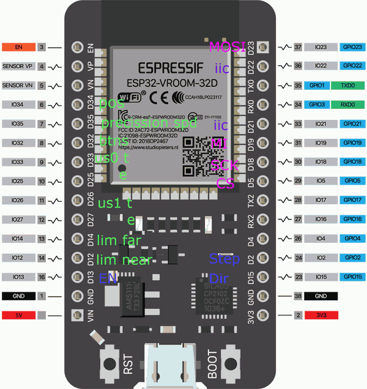

# pot_recorder
Record and play of potentiometer position and map  it to stepper motor position, LED dimmer or ws2812 
Made for stepper motor but also suitable for dimmers, heaters, music, itc..

## Working:
1. start record
2. move potentiometer or other input/sensor
3. stop recording 
4. Play
### interactive GUI instruction,
<https://pavel-b-kr12.github.io/recorder_for_potentiometer/index.htm>
also  simulation and data plotter (currently disabled)

## Features
- [x] record to SD card.
- [x] Several record slots available. slot 9 is for settings of max Speed, Acceleration, cyclic replay.
- [x] stepper motor output. Default is manual mode - move pot - motor meves according to it range
- [ ] TODO PWM (i.e. dimmer) output
- [ ] TODO WS2812b* output

- [x] playback speed, pause 
- [x] support some use of US-015 or other ultrasonic 

## hardware
* ESP32 (support of atmega328 completely broken, if you want - i will fix it or upload last version with it working)
* SD cart (support of EEPROM probably completely broken, if you want - i will fix it)
* OLED IIC 128*32

## TODO
*upload video
*wiring diagrams

## connection schematics

## test results for stepper motor
#### UNO+shield for 1 motor #define FastAccelStepper

up to 25k steps /sec (related to acceleration)

#### UNO+CNC_shield_v3  do not //#define FastAccelStepper

up to 4000 steps /sec (1000 working good)

#### ESP32 #define FastAccelStepper
speed limited by acceleration.  acceleration limited by stepper driver. 35-90k steps/s achived with microsteps on NEMA17 good motor + A4988 driver without big motor load

